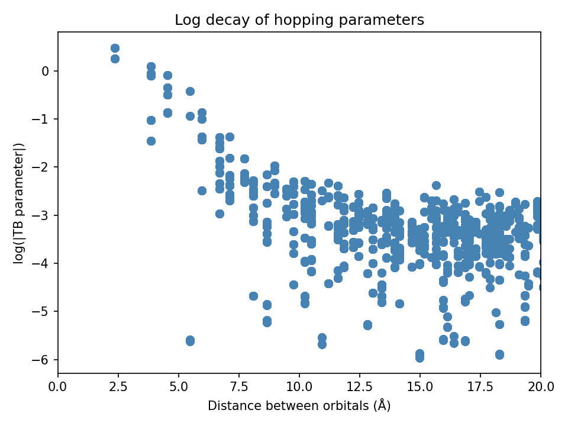

# COGITO Documentation Website

**Comprehensive documentation and examples for COGITO - Crystal Orbital Guided Iteration To atomic-Orbitals**

[](https://olipemil.github.io/cogito-website)
[](https://github.com/olipemil/COGITO)
[](https://jekyllrb.com)

This repository hosts the documentation website for COGITO, a tool for obtaining quantum chemistry from plane wave DFT calculations. The website provides interactive tutorials, API documentation, and Jupyter notebook examples.

## 🚀 Quick Start

**Visit the live website:** [**cogito-website.github.io**](https://olipemil.github.io/cogito-website)

| Section | Description |
|---------|-------------|
| [🔧 Installation](https://olipemil.github.io/cogito-website/examples/installation_setup.html) | Get started with COGITO setup |
| [📚 Tutorial](https://olipemil.github.io/cogito-website/tutorial/) | Step-by-step analysis workflow |
| [💻 Examples](https://olipemil.github.io/cogito-website/examples/) | Interactive Jupyter notebooks |
| [📑 API Docs](https://olipemil.github.io/cogito-website/api/) | Complete function reference |

## ✨ Key Features

<div align="center">


*Interactive crystal bonding visualization*

</div>

- **🔬 Chemical Bonding Analysis** - COHP/COOP analysis with band structure
- **📊 Band Structure** - Compare COGITO interpolation with DFT
- **⚛️ Orbital Projections** - Visualize atomic orbital contributions
- **🏗️ Crystal Visualization** - 3D structures with actual covalent bonds
- **📈 Quality Verification** - Built-in validation against VASP calculations

## 🎯 Basic Workflow

```python
# Step 1: Generate COGITO model
from COGITOmain import COGITO
COGITOmodel = COGITO("your_vasp_directory/")
COGITOmodel.generate_TBmodel()

# Step 2: Analyze results
from COGITOpost import COGITO_analyze as coze
COGITOTB = coze("your_vasp_directory/")
COGITOTB.compare_to_DFT("your_vasp_directory/")
COGITOTB.get_bandstructure()
```

## 📊 Example Results

| Analysis Type | Output | Description |
|---------------|--------|-------------|
| **Band Structure** |  | COGITO vs DFT comparison |
| **COHP Analysis** |  | Bonding/antibonding contributions |
| **Parameter Decay** |  | Tight binding quality check |

## 🛠️ Website Development

This website is built with Jekyll and features:
- **Auto-updating documentation** from the main COGITO repository
- **Interactive Jupyter notebooks** embedded via NBViewer
- **Responsive design** for mobile and desktop
- **API documentation** auto-generated from source code

### Local Development
```bash
git clone https://github.com/olipemil/cogito-website.git
cd cogito-website
bundle install
bundle exec jekyll serve
```

## 📁 Repository Structure

```
cogito-website/
├── api/                    # Auto-generated API documentation
├── examples/               # Jupyter notebook examples
├── tutorial/               # Step-by-step tutorials
├── docs/                   # Static assets and images
├── scripts/                # Automation scripts
└── _layouts/               # Jekyll templates
```

## 🔄 Auto-Update System

The website automatically updates when the main COGITO repository changes:
- **API documentation** regenerated from source code docstrings
- **Examples** updated from latest notebooks
- **Cross-repository automation** via GitHub Actions

## 🤝 Contributing

### Main COGITO Code
Contribute to the main package: [**COGITO Repository**](https://github.com/olipemil/COGITO)

### Documentation & Website
- Improve tutorials and examples
- Fix documentation issues
- Enhance website functionality

## 📄 License

This project is licensed under the MIT License - see the [LICENSE](LICENSE) file for details.

## 📮 Contact

- **Main Repository**: [GitHub/COGITO](https://github.com/olipemil/COGITO)
- **Issues**: [COGITO Issues](https://github.com/olipemil/COGITO/issues)
- **Website Issues**: [Website Issues](https://github.com/olipemil/cogito-website/issues)

---

<div align="center">

**[🔬 Main COGITO Repo](https://github.com/olipemil/COGITO)** |
**[🚀 Quick Start](https://olipemil.github.io/cogito-website/examples/installation_setup.html)** |
**[💻 Examples](https://olipemil.github.io/cogito-website/examples/)**

</div>
