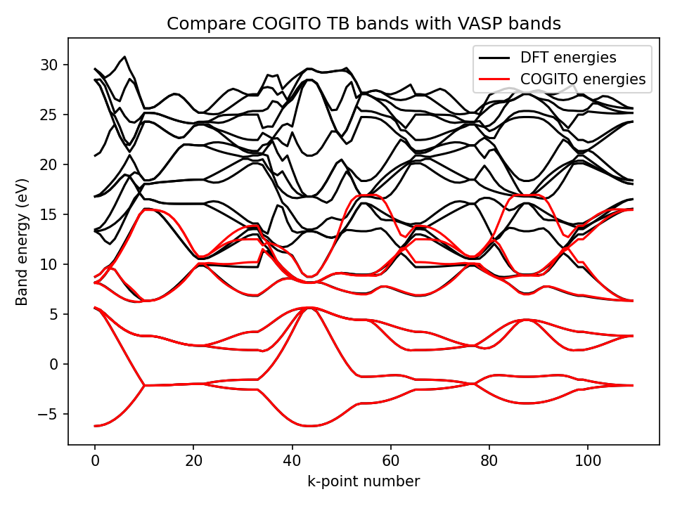
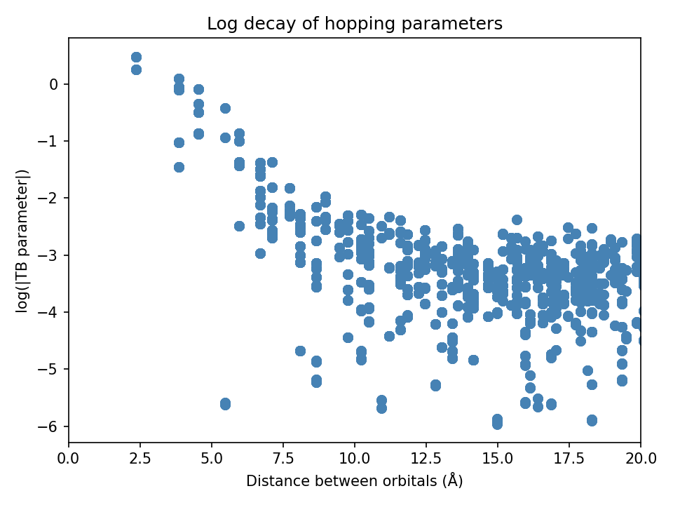
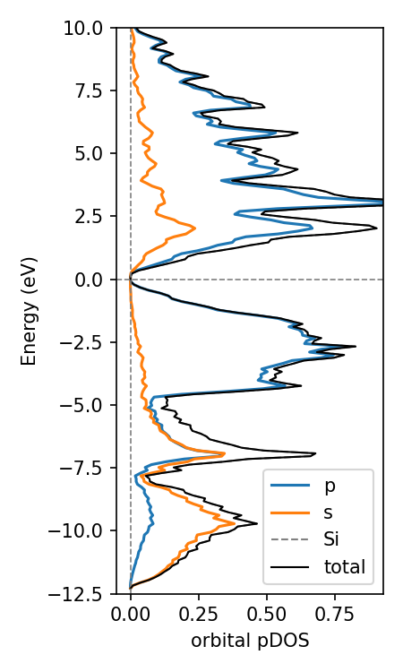

## Welcome to COGITO!

Crystal Orbital Guided Iteration To atomic-Orbitals (COGITO) is a tool for obtaining quantum chemistry from plane wave DFT calculations. The code maps the plane wave basis to our COGITO basis. With this we can trace back which bonds are contributing to the independent particle energies. Leverging this, we can plot the crystal structure with their actual quantum chemical covalent bonds, determine origins of electronic structure, charge transfer, and more!

Observe the bonding in the α-PbO structure by hovering over the bond lines. Solid lines indicate bonding while dashed lines indictate antibonding. The width of the line is proprotional to the magnitude of the bond energy.

    

        <iframe src="docs/PbO/crystal_bonds.html" style="transform: scale(0.75); transform-origin: top left; width: 150%; height: 150%; border: 0;"></iframe>
    

## Workflow

<iframe src="{{ site.baseurl }}/workflow_diagram.html" style="transform: scale(0.9); transform-origin: top left;" width="800px" height="450px"></iframe>

## Quick Guide 

Click link for more detailed example in the tutorial page.

<h3 id="VASP">Run VASP</h3>

A couple things to keep in mind for the VASP calculation:

* Must be a static run (NSW=0)
* Use an irreducible grid (ISYM=1,2,3)
* Save the wavefunctions (LWAVE=True)
* Use more bands (NBANDS=(8-16)*natoms)
* No spin-orbit coupling (LSORBIT=False, but magnetism is supported (ISPIN=2)

<h3 id="COGITO">Run COGITO</h3>

COGITO reads the INCAR, POSCAR, POTCAR, and WAVECAR files from the VASP calculation. The only required input when calling the COGITOmain class from the user is if the VASP calculation has ISPIN=2 set spin_polar=True. Otherwise, just pass the directory and let the default values handle everything!

COGITO generates the atomic basis and save the tight binding model in three files which will be used to initialize the next step.

* tb_input.txt
* TBparams.txt
* overlaps.txt

<h3 id="tight">Run COGITO tight binding</h3>

This is where things start to get fun!
Here are some capabilities to plot and verify the COGITO run.

    

        <a href="{{ site.baseurl }}/tutorial/#compareDFT">
            
            
Compare COGITO bands to VASP

        </a>
    

    

        <a href="{{ site.baseurl }}/tutorial/#tight">
            
            
Plot parameter decay

        </a>
    

<h3 id="bandstruc">Run Bandstructure generator</h3>

This class is for generates a band structure from a default high symmetry line from pymatgen. 

    

        <iframe src="./docs/Si/COHP_BS.html" style="transform: scale(0.5); transform-origin: top left; width: 200%; height: 200%; border: 0;" class="image-hover"></iframe>
        <a href="{{ site.baseurl }}/tutorial/#COHPBS">
            
Plot projected COHP/COOP

        </a>
    

    

        <iframe src="./docs/Si/projectedBS.html" style="transform: scale(0.5); transform-origin: top left; width: 200%; height: 200%; border: 0;" class="image-hover"></iframe>
        
<a href="{{ site.baseurl }}/tutorial/#projectBS">Plot orbital projected band structure</a>

    

<h3 id="uniform">Run Uniform generator</h3>

This generates a uniform k-point grid, able to perform DOS and itegrated band energy analysis.

    

        <a href="{{ site.baseurl }}/tutorial/#projectDOS">
            
            
Plot orbital projected DOS

        </a>
    

    

        
        
Plot COHP/COOP energy density

    

    

        <a href="{{ site.baseurl }}/tutorial/#bonds">
            <iframe src="docs/Si/crystal_bonds.html" style="transform: scale(0.75); transform-origin: top left; width: 150%; height: 150%; border: 0;" class="image-hover"></iframe>
            
Plot crytstal with COGITO bonds

        </a>
    

  

