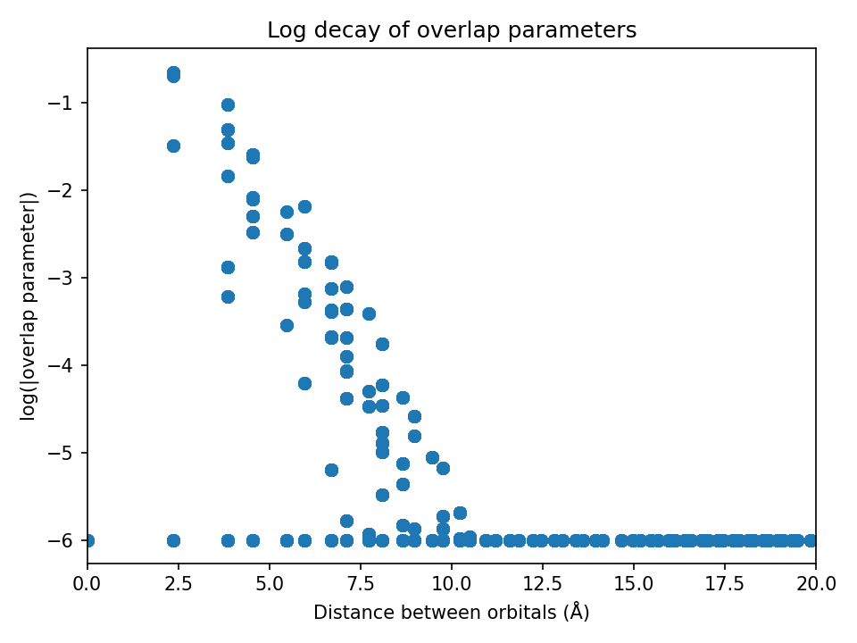
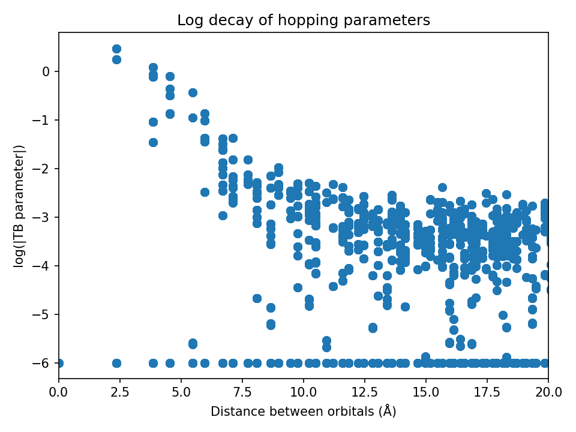
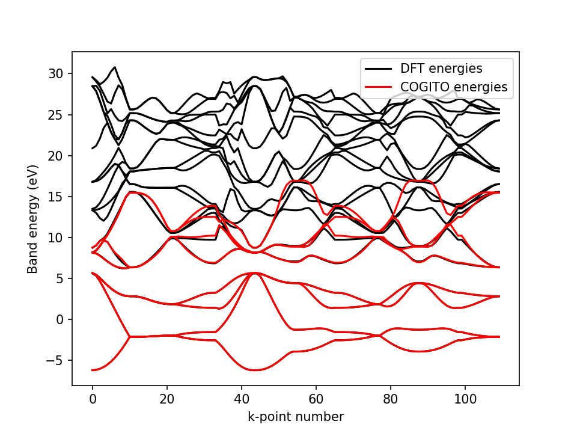

## Welcome to COGITO

Your welcome statement and introduction goes here...

[Home](./index.md)

[Functionality](./functionality.md)

[Workflow](./workflow.md)

## Main Code

The core of COGITO is responsible for generating the basis and constructing the tight-binding (TB) model. This is the foundational step in the workflow, where the primary calculations and basis functions are established.

# Workflow

<iframe src="./workflow_diagram.html" width="800" height="400" style="border:none;"></iframe>

## Quick Guide 

Click link for more detailed example in the tutorial page.

### Run VASP

A couple things to keep in mind for the VASP calculation:

* Must be a static run (NSW=0)
* Use an irreducible grid (ISYM=1,2,3)
* Save the wavefunctions (LWAVE=True)
* Use more bands (NBANDS=(8-16)*natoms)
* No spin-orbit coupling (LSORBIT=False, but magnetism is supported (ISPIN=2)

### Run COGITO

COGITO reads the INCAR, POSCAR, POTCAR, and WAVECAR files from the VASP calculation. The only required input when calling the COGITOmain class from the user is if the VASP calculation has ISPIN=2 set spin_polar=True. Otherwise, just pass the directory and let the default values handle everything!

COGITO generates the atomic basis and save the tight binding model in three files which will be used to initialize the next step.

* tb_input.txt
* TBparams.txt
* overlaps.txt

### Run COGITO tight binding

This is where things start to get fun!
Here are some capabilities to plot and verify the COGITO run.

    

        
    
Plot overlap decay

    

    

        
        
Plot hopping decay

    

    

        
        
Compare COGITO bands to VASP

    

    
    
    

### Run Bandstructure generator

This class is for generates a band structure from a default high symmetry line from pymatgen. 

    

        <iframe src="./COHP_BS.html" style="transform: scale(0.5); transform-origin: top left; width: 200%; height: 200%; border: 0;" class="image-hover"></iframe>
    
Plot projected COHP/COOP

    

    

        <iframe src="./projectedBS.html" style="transform: scale(0.5); transform-origin: top left; width: 200%; height: 200%; border: 0;" class="image-hover"></iframe>
        
Plot orbital projected band structure

    

## 1. Static VASP Calculation

Initial calculations are performed using VASP with an indelible uniform grid. This provides the necessary data for generating the tight-binding model.

