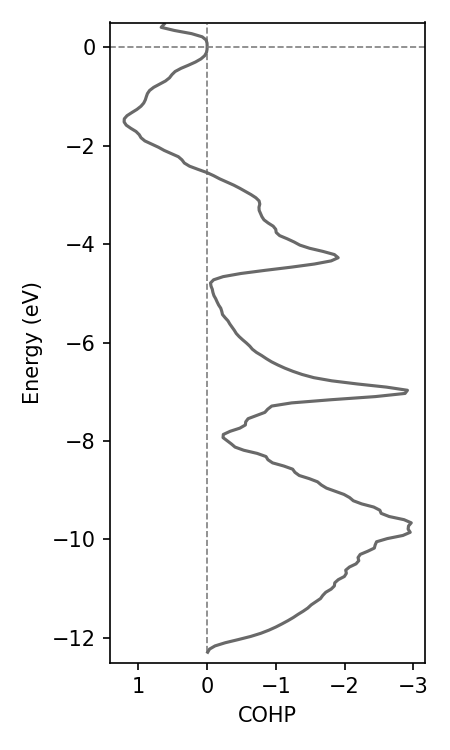

## Welcome to COGITO!

Crystal Orbital Guided Iteration To atomic-Orbitals (COGITO) is a tool for obtaining quantum chemistry from plane wave DFT calculations. The code maps the plane wave basis to our COGITO basis. With this we can trace back which bonds are contributing to the independent particle energies. Leverging this, we can plot the crystal structure with their actual quantum chemical covalent bonds, determine origins of electronic structure, charge transfer, and more!

Observe the bonding in the α-PbO structure by hovering over the bond lines. Solid lines indicate bonding while dashed lines indictate antibonding. The width of the line is proprotional to the magnitude of the bond energy.

    

        <iframe src="docs/PbO/crystal_bonds.html" style="transform: scale(0.75); transform-origin: top left; width: 150%; height: 150%; border: 0;"></iframe>
    

## Quick Guide 

Click image for more detailed example in the tutorial page.

<h3 id="tight">Verify quality of COGITO run</h3>

    

        <a href="{{ site.baseurl }}/tutorial/#compareDFT">
            
            
Compare COGITO bands to VASP

        </a>
    

    

        <a href="{{ site.baseurl }}/tutorial/#tight">
            
            
Plot parameter decay

        </a>
    

<h3 id="bandstruc">Plot with band structure k-grid</h3>

    

        <a href="{{ site.baseurl }}/tutorial/#COHPBS">
            <iframe src="./docs/Si/COHP_BS.html" style="transform: scale(0.5); transform-origin: top left; width: 200%; height: 200%; border: 0;" class="image-hover"></iframe>
            
Plot projected COHP/COOP

        </a>
    

    

        <a href="{{ site.baseurl }}/tutorial/#projectBS">
            <iframe src="./docs/Si/projectedBS.html" style="transform: scale(0.5); transform-origin: top left; width: 200%; height: 200%; border: 0;" class="image-hover"></iframe>
            
Plot orbital projected band structure

        </a>
    

<h3 id="uniform">Plot with uniform k-grid</h3>

    

        <a href="{{ site.baseurl }}/tutorial/#projectDOS">
            
            
Plot orbital projected DOS

        </a>
    

    

        
        
Plot COHP/COOP energy density

    

    

        <a href="{{ site.baseurl }}/tutorial/#bonds">
            <iframe src="docs/Si/crystal_bonds.html" style="transform: scale(0.75); transform-origin: top left; width: 150%; height: 150%; border: 0;" class="image-hover"></iframe>
            
Plot crytstal with COGITO bonds

        </a>
    

  

